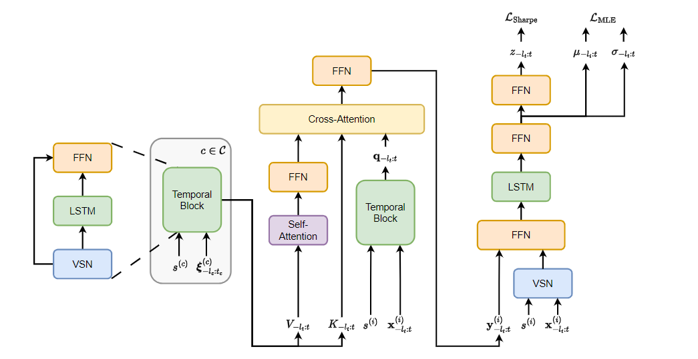
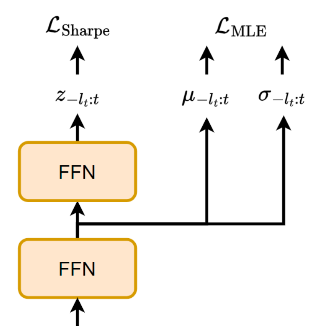
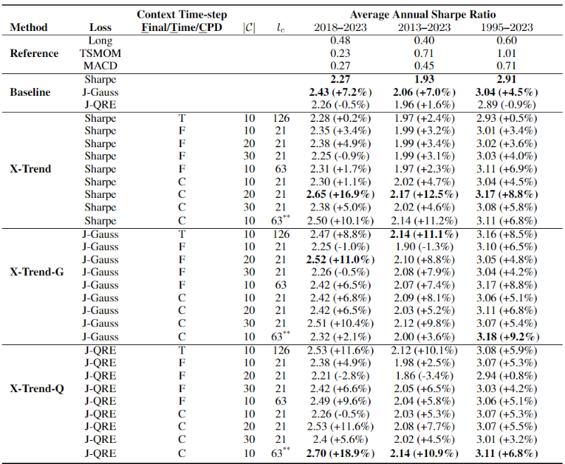
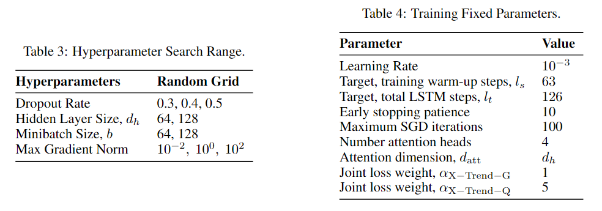

# x-trend 预测网络

1. **持仓目标**

    我们的目标是交易一个头寸 $z_{t}^i$，我们的目标是选择一个持仓 $z_{t}^i$，其取值范围在 $[-1 ,1]$ 之间。之间，这表示我们可以选择做多、做空或不持仓。这个持仓将在 $t+1$ 日持有。

2. **目标序列 $x^{i}_{-l_t:t}$**

   这个持仓决定是基于过去 $l_t$ 天的目标序列 $x^i_{-l_t:t}$ 。目标序列包含了过去 $l_t$ 天的特征信息，用于帮助模型做出预测。

3. **特征向量 $x^i_t$**：
   特征向量 $x^i_t$ 是一个包含 $|X|$ 个因子的向量，这些因子用于衡量不同时间尺度上的趋势或不同时间尺度之间的趋势关系。这些因子是通过收益数据和价格数据构建的。

4. **最大化投资组合收益**：
   模型的目标是选择持仓 $z^i_t$，即每个资产t时刻的次日持仓，以最大化投资组合的收益
   $$ R_{Port. t+1} = \frac{1}{N} \sum_{i=1}^N R^i_{t+1} $$
   其中，
   $$ R^i_{t+1} = z^i_t \frac{\sigma_{tgt}}{\sigma^i_t} r^i_{t+1} - C^i \sigma_{tgt} \left| \frac{z^i_t}{\sigma^i_t} - \frac{z^i_{t-1}}{\sigma^i_{t-1}} \right| $$

   - $R_{Port. t+1}$ 表示第 $t+1$ 日的投资组合收益。
   - $R^i_{t+1}$ 表示第 $t+1$ 日第 $i$ 个资产的收益。
   - $z^i_t$ 是第 $t$ 日选择的持仓。
   - $\sigma_{tgt}$ 是目标波动率。
   - $\sigma^i_t$ 是第 $i$ 个资产在第 $t$ 日的实际波动率。
   - $r^i_{t+1}$ 是第 $t+1$ 日第 $i$ 个资产的实际收益。
   - $C^i$ 是交易成本。

    解读：这个组合收益使用了杠杆因子$\frac{\sigma_{tgt}}{\sigma^i_t}$来调整收益率，将资产 $i$ 的波动率与目标波动率相除，来调整持仓。这篇文章中，$C^i$ 设置为 0 来表现展现模型的预测能力。

## Inputs

**$s$**：context实体嵌入表示

**$\xi$**: context资产的波动率scaled回报率序列

**$x$**: 一个趋势序列，$\sigma_t^{(i)}$ 是之前60天的 exponentially weighted moving standard deviation of returns

$$
\hat{r}^{(i)}_{t-t',t} = r^{(i)}_{t-t',t} / \sigma^{(i)}_t \sqrt{t'},
$$

$$
\mathbf{x}^{(i)}_t = \text{Concat} \left( [\hat{r}^{(i)}_{t-t',t} \mid t' \in \{1, 21, 63, 126, 252\}], [\text{MACD} (p^{(i)}_{1:t}, S, L) \mid \forall (S, L)] \right).
$$

## 输出

模型输出两个参数：预测均值 $\mu_{-l_t:t}$ 和预测标准差 $\sigma_{-l_t:t}$，这些参数构成了一个正态分布，用于描述 $t+1$ 的收益分布。

**$\sigma_{-l_t:t}$**: 是根据输入特征 $x_{-l_t:t}$、静态信息 $s$ 和上下文集 $C$ 预测得到的每一个时间步下一天收益波动率。

**$\mu_{-l_t:t}$**: 根据输入特征 $x_{-l_t:t}$、静态信息 $s$ 和上下文集 $C$ 预测得到的每一个时间步下一天收益期望。

**$z_{-l_t:t}$**: 模型预测的交易头寸。根据模型对于次日收益概率密度函数的预测，输入一个前馈神经网络，被成为  **P**redictive distribution (mean and standard deviation) **T**o **P**osition $\mathbf{PTP_G}$（即图片上方的FFN） 计算而来。

从输入 $x^i_{-l_i:t}$ 到 $z_{-l_t:t}$ 这整个模型被称为 **Cross** Attentive Time-Series **Trend** Network **XTrend**

## 损失函数

联合损失函数由最大似然估计（MLE）损失和夏普比率（Sharpe Ratio）损失组成，两者的占比由一个超参数 $\alpha$ 控制。

$$
\mathcal{L}^{MLE}_{Joint}(\theta) = \alpha \mathcal{L}_{MLE}(\theta) + \mathcal{L}^{PTP_G(\cdot)}_{Sharpe}(\theta)
$$

最大似然估计（MLE）：用于衡量模型预测的均值和标准差与实际观察到的收益之间的差异。具体来说，我们的模型 **XTrend** 最后输出一个长度为$l_t$的时间序列，每个时间步特征数目为2。这个序列为我们的样本次日分布特征值。取最后一个时间步输出作为下一日的分布特征，之前的时间步被舍弃。

$$
\mathcal{L}_{MLE}(\theta) = -\frac{1}{|\Omega|} \sum_{(t, i) \in \Omega} \log p \left( \frac{\sigma_{tgt}}{\sigma^{(i)}_t} r^{(i)}_{t+1} \middle| \mathbf{x}^{(i)}_{-l_t:t}, s^{(i)}, C \right)
$$

夏普比率（Sharpe Ratio）: 基于夏普比率的损失函数，衡量模型在风险调整后的收益表现。$\mathbf{PTP_G}$ 模块将预测的均值和标准差转换为交易头寸。具体来说，我们的模型 **XTrend** 最后输出一个长度为$l_t$的时间序列，取最后一个时间步作为下一日的持仓，之前的时间步被舍弃。

$$
\mathcal{L}_{Sharpe}^{XTrend(\cdot)}(\theta) = -\sqrt{252} \frac{\text{mean}_{\Omega} \left[ \frac{\sigma_{tgt}}{\sigma^{(i)}_t} r^{(i)}_{t+1} \text{XTrend} \left( \mathbf{x}^{(i)}_{-l_t:t} \right) \right]}{\text{std}_{\Omega} \left[ \frac{\sigma_{tgt}}{\sigma^{(i)}_t} r^{(i)}_{t+1} \text{XTrend} \left( \mathbf{x}^{(i)}_{-l_t:t} \right) \right]}
$$

## 参数

